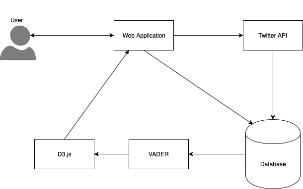
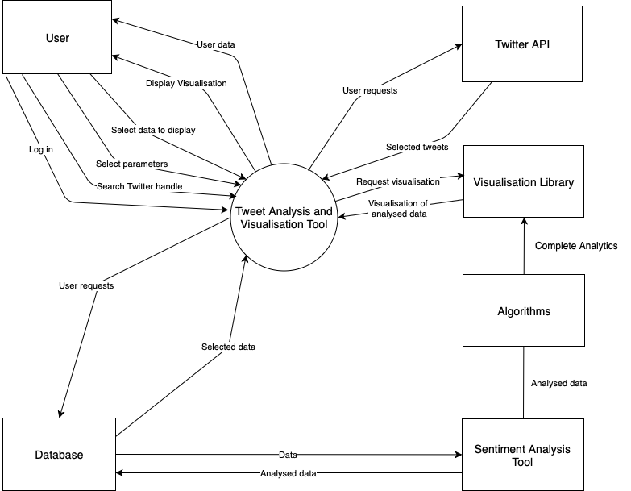
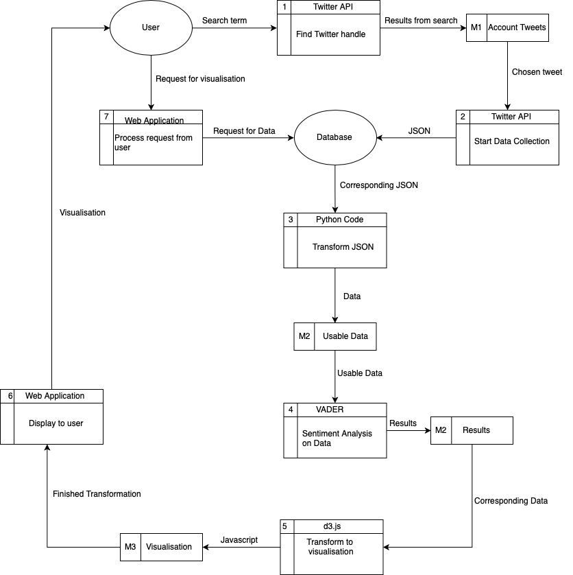
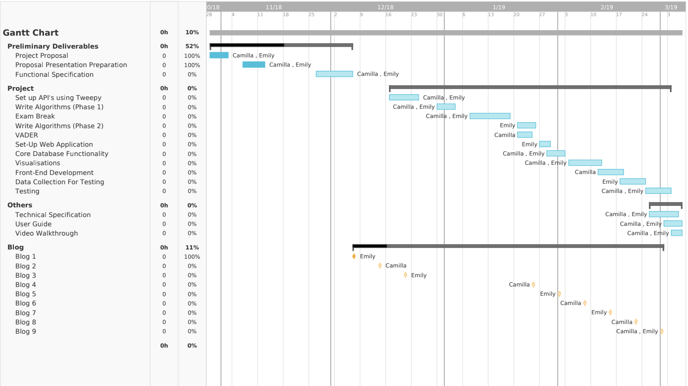

# Functional Specification
**
 Camilla Boyle & Emily McGivern 
**  

* [**1. Introduction**](#introduction)
  * [**1.1. Overview**](#overview) 
  * [**1.2. Glossary**](#glossary)  
* [**2. General Description**](#general-description)  
  * [**2.1. Product / System Functions**](#product-system-functions)  
  * [**2.2. User Characteristics and Objectives**](#user-characteristics-and-objectives)  
  * [**2.3. Operational Scenarios**](#operational-scenarios)  
     * [**2.3.1. Register with Email Address**](#register-with-email-address)  
     * [**2.3.2. Register with Twitter Account**](#register-with-twitter-account)  
     * [**2.3.3. Log In**](#log-in)  
     * [**2.3.4. Create Analysis**](#create-analysis)  
     * [**2.3.5. Set Parameters**](#set-parameters)  
     * [**2.3.6. Entering Profile Page**](#entering-profile-page)  
     * [**2.3.7. Viewing Results**](#viewing-results)  
     * [**2.3.8. Log Out**](#log-out)  
  * [**2.4. Constraints**](#constraints)  
     * [**2.4.1. Testing Constraints**](#testing-constraints)  
     * [**2.4.2. Time Constraints**](#time-constraints)  
     * [**2.4.3. Choice of Tweets Constraints**](#choice-of-tweets-constraints)  
     * [**2.4.4. API Constraints**](#api-constraints)  
* [**3. Functional Requirements**](#functional-requirements)  
  * [**3.1. User Registration**](#user-registration)  
  * [**3.1. Login**](#login)  
  * [**3.1. Search Functionality**](#search-functionality)  
  * [**3.1. Parameter Selection**](#parameter-selection)  
  * [**3.1. Real-Time Analysis**](#real-time-analysis)  
  * [**3.1. Twitter Scraping**](#twitter-scraping)  
  * [**3.1. Sentiment Analysis**](#sentiment-analysis)  
  * [**3.1. Historical Data**](#historical-data)  
  * [**3.1. Database**](#database)  
  * [**3.1. Generating Statistics and Analysis**](#generating-statistics-and-analysis)  
  * [**3.1. Visualisations**](#visualisations)  
  * [**3.1. Operations on Historical Data**](#operations-on-historical-data)  
* [**4. System Architecture**](#system-architecture)  
  * [**4.1. System Architecture Overview**](#system-architecture-overview)  
  * [**4.2. System Architecture Diagram**](#system-architecture-diagram)  
* [**5. High-level Design**](#high-level-design)  
  * [**5.1. Context Diagram Overview**](#context-diagram-overview)  
     * [**5.1.1. Context Diagram**](#context-diagram)  
  * [**5.2. Data Flow Diagram**](#data-flow-diagram)  
* [**6. Preliminary Schedule**](#preliminary-schedule)  
  * [**Gantt Chart**](#gantt-chart)  
* [**7. Appendices**](#appendices)  
  * [**7.1. Resources**](#resources)  
  
&nbsp;  
  

&nbsp;  

  

&nbsp;  

***  
  

&nbsp;  

  
&nbsp;  

  
&nbsp;

### 1. Introduction

#### 1.1 Overview

The Tweet Analytics and Visualisation tool is a web-based analysis tool. This tool is a rich, multi-parametric, personalised analytics tool. It will provide a user numerous ways to intuitively visualise and understand the outcome of the analytics that they have tailored to suit them. Social media has become a huge channel for businesses in so many ways. It serves as a marketing tool, allowing businesses to identify opportunities and insights to ensure they are satisfying their customer’s needs. It also allows customer assessment to enable a business to meet the needs of their customer fully. Social media also serves as a platform for investigating a customer, allowing a business to grow and evolve in accordance with what a consumer wants from them. A business can reach a huge customer base through their social media channels, and can also introduce a huge amount of new customers to their brand. However, the reaction to posts, the resulting chain effect and the consequences of this over time can sometimes be hard to measure due to the sheer amount of attention a post will get. The point of this tool is to supply a user with a powerful tool to do just that. Twitter is a hugely popular social media channel for businesses due it being an open platform. It also has a huge amount of data due to the sheer amount of users on the platform. This is the reason the tool will focus on Twitter. By using this tool, the user will be able to hone in on the tweet or tweets that are relevant to them. This will produce a narrower data set, but will ensure that there is no irrelevant data. In doing this, the user will be able to measure the tweet’s popularity, the comments which are generated towards the post and the magnitude of the polarity that the post generates over time.

The user will select a Twitter handle to analyse and then may select the tweets using the parameters provided such as filtering by the number of responses to the tweet, the positive or negative responses the tweet has gathered, the time at which the tweet was posted, and the length of time the analysis will run for. The application will gather data over a specified period of time which can be chosen by the user. After this data has been gathered, it will be analysed to create useful and meaningful analytics. To ensure these analytics are of value to the user, it is important that we use a well-designed algorithm. Creating this algorithm will involve investigation into what sort of data will be useful to a company. This data will then be presented to the user in the form of interesting visualisations. This data will be retained, and stored in the user search history so that the user can return at any time to view the visualisations again. This will greatly benefit a user in a multitude of ways. It will allow a user to understand the interactions that the tweets generate. From this, they can see what tweets performed successfully, and which of them performed less so. It will also allow the user to examine whether their expected reaction to the post was accurate or not, and help them to improve their social media interactions going forward.



&nbsp;


#### 1.2 Glossary
**Bootstrap** - free and open-source front-end framework for designing websites and web applications  
**Django** - high-level Python web framework  
**Sentiment Analysis** - the process of computationally identifying and categorising opinions expressed in a piece of text, especially in order to determine whether the writer's attitude towards a particular topic is positive or negative  
**VADER (Valence Aware Dictionary and sEntiment Reasoner)** - lexicon and rule-based sentiment analysis tool that is specifically attuned to sentiments expressed in social media  
**Python** - interpreted high-level programming language for general-purpose programming  
**API (Application Programming Interface)** - set of routines, protocols, and tools for building software applications  
**D3.js** - JavaScript library for manipulating documents based on data  
**Tweepy** - A Python library for accessing the Twitter API  
**SQL** - Structured Query Language  
  
&nbsp;

  
&nbsp;
  
###  2. General Description

####  2.1 Product / System Functions
The general functionality of this web application is to display meaningful and useful analytics to a user based on social media data that they have specified. The user will be supported in digging through tweets to find a subset of tweets they might be interested to monitor. Among this reduce set, the user will be able to see more details and choose a specific tweet posted by a chosen user, and will be able to specify various parameters in terms of how long they want the tool to monitor the evolution/impact of that tweet from that moment on. Once this time limit has been reached, or at any intermediate time if the user decides to trigger the analysis earlier, the data will be analysed and results will be presented as an intuitive and self-explanatory visualisation. The analysis will be broken down into the following categories:

* The popularity of the tweet and its evolution/magnitude over time
* The polarity of the tweet and its trend (popularity generated by the tweet) over time

In order to make the visualisations interesting, they will show the evolution of the reactions to the tweet over time. We will compare and contrast the collected data and see how the results vary over a period of time.  The visualisation aspect is hugely important in conveying this to the user.  

&nbsp; 

####  2.2 User Characteristics and Objectives
This tool will be a web-based application. Therefore, it can be accessed by anyone with an internet connection. The target audience will be various employees of a business, such as members of the marketing team, marketing campaign managers, communication officers or anyone who runs or interacts with their social media account. The main employee targeted is one working in the marketing department who can make use of the analytics that are generated. 

The interface will be simple and tidy. The information will be returned in interesting visualisations which are striking and easy to understand. It is important to ensure the graphs are not complicated, as this would result in users not being able to make the most of the data.  As the visualisations are the focus of the UI, it is important that they are the dominant element. Users will not need extensive knowledge to use this tool. Knowledge of basic web features such as login, entering text into search boxes and selecting filtering options is required.

The objective is to supply information that is relevant and customised for the user. This is so that the user can easily decide what specifically to analyse. The user can then use these analytics to examine how their marketing strategies on Twitter perform, and change them according to the general reaction. The user can log on and immediately search for the tweet they want to monitor from a particular Twitter handle and collect data over a period of time. Once the collection of data is complete (i.e. the set time has passed), the analytics are performed and made available to the user who can then explore them.  
  
&nbsp;
  
####  2.3 Operational Scenarios

**Use-Cases**

#####  2.3.1 Register with Email Address
* _Goal in context:_ User successfully registers themselves on the website

User accesses website by entering the address into their chosen browser’s address bar. When the website has loaded, the user will be presented with a login/register screen. If the user has not previously used the website, the user will click the register button.  
There will be two options on this page. Either the user can register with an email address and create a username and password, or they may register with a Twitter account. If registering using a Twitter account, the user will click on the button labelled “Use Twitter”

Should the user decide to register with an email address, they will be prompted to enter this email address into a text box along with a preferred username and a corresponding password in a second and third text box. The user will then be asked to confirm their password by entering it again in a further textbox.  
A button labelled “register” will be underneath these options.  
If the passwords match, a message accepting registration will be displayed. The user will then be redirected to the login page.  
If the passwords do not match, the user will be instructed to re-enter their password in the corresponding two text boxes.  
If the email address is already attached to a user, an alert will be displayed and the user will be redirected to the login page.  
If the username is already attached to a different email address, the user will be alerted and prompted to enter a different username in the textbox provided.

#####  2.3.2 Register with Twitter Account
* _Goal in context:_ User successfully registers themselves using Twitter account

Should the user decide to register with a Twitter account, they will click on the button labelled “Use Twitter”. They will then be redirected to the Twitter login page where they will enter their Twitter account name and password and click a sign in button.
The user will then be logged in and redirected to the user’s main page on our website.

#####  2.3.3: Log In  
* _Goal in context:_ User successfully logs into website

User accesses website by entering the address into their chosen browser’s address bar. When the website has loaded, the user will be presented with a login/register screen. If the user has previously used the website, the user will enter either their username or Twitter handle into a textbox followed by their password in a further textbox. Three buttons will be on the screen below these textboxes, they will be labelled ‘forgot username’, ‘forgot password’ and ‘login’.  
If the user selects either the ‘forgot password’ or ‘forgot username’ button, they will be asked to enter the email address used to create the account in a textbox. A button to click confirm this will be displayed. Upon entering this, they will receive an email with a link to reset their password or reminding them of their username and will be redirected to the login/register screen.  
If the user selects login and their username and password match, the users profile and menu screen will appear.  
If the user selects ‘login’ and their username and password do not match, the screen will display an alert inviting them to re-enter their details in the textboxes. 

#####  2.3.4: Create Analysis  
* _Goal in context:_ User accesses website in order to create a visualisation

When the user has logged into the website, there will be several options displayed on the user’s home screen. The main screen will have several options. At the top will be a drop down menu where the user can select to go to their profile page, go to their analytics, or logout.  
In the center of the screen will be a large text box where the user will enter a Twitter handle.  
If the Twitter handle does not exist, a message will be displayed inviting the user to re-enter a valid Twitter handle.  
If the Twitter handle exists, the description and the number of followers of the account will be displayed, and the choice to set parameters is shown.

#####  2.3.5: Set Parameters  
* _Goal in context:_ User sets parameters for their analysis

The user will be invited to select parameters in order to filter the data according to what the user would like to monitor. The filters will be displayed underneath the search bar. The filters will be in the form of drop down menus and text boxes depending on whether the user is selecting timeframe, hashtag or number of interactions with the tweet.  
The user clicks on a submit button that will be underneath the filter options. A message box will be displayed to alert the user that the analysis has started.
The user will then be redirected to the main screen.
The user will select the tweet or tweet to monitor from these options by clicking on a radio button and will select the time frame to track the tweet by selecting the option from a drop down menu.  
A message will appear confirming the user’s choice.
When the results have been gathered, the website will send the user an email. A notification will also appear on the user’s home page to alert them that a new analysis is ready to be visualised.

#####  2.3.6: Entering Profile Page  
* _Goal in context:_ User accesses their profile information

When the user has logged into the website if they want to access their profile information, they select ‘profile’ from the drop down menu at the top of the page. When this has been selected, they will be redirected to their profile page. The information on their profile page will be their username, their email address, their password and their analytics search history.  
There will be ‘edit’ buttons that will be placed beside each of these pieces of information. If a user clicks on the edit button beside the username, email or password options, the website will allow a user to edit any of their profile information by typing in a text box and clicking on a ‘save’ button that will appear.  
If they click on the edit button placed beside their analytics search history, radio buttons will appear next to each search. The user can select one or more of these buttons and can chose to delete past searches by clicking on the ‘delete’ button. On the profile page their running/terminated analyses will be visible.

#####  2.3.7: Viewing Results  
* _Goal in context:_ User access website in order to see visualisation

The user is alerted by email that the target has been reached and there is a new analysis available to visualise. Upon receiving this email, the user logs into the website. From here, they will select the ‘analytics’ option from a drop down menu at the top of the user’s home page. The data that has already been prepared is displayed on the user’s profile page under the title ‘history’.
The user will select the type of visualisation that he or she wishes to view from a drop down menu. The user will click on a ‘confirm’ button underneath this menu. 
The visualisation will be displayed on the page.

#####  2.3.8: Log Out  
* _Goal in context:_ User logs out of website

When the user has completed their chosen activity and wishes to log out they can select ‘log out’ from the drop down menu that is visible from every page on the website. If the user clicks on the ‘log out’ button, the user is redirected to the log in/register page of the website.

&nbsp;

####  2.4 Constraints
#####  2.4.1 Testing Constraints
We must ensure that we leave enough time to gather data in order to test our application properly as we must have a sample of data gathered over time.

#####  2.4.2 Time Constraints
The project’s completion date is 8th March 2019. We must ensure that we stick closely to our planned timeline to ensure that we have the project completed before the deadline.

#####  2.4.3 Choice of Tweets Constraints
We must ensure that we have properly configured parameters so that we are not collecting redundant data. This will involve more research into the Twitter APIs so that we can understand how to set parameters.

#####  2.4.4 API Constraints
Due to the fact that we are using standard API endpoints only, it is possible we will experience rate limiting. However, as the rate limits are divided into 15 minute intervals, thus we should verify that we do not exceed these limits in the timeframe. Each rate-limit is set per-method so we will need to ensure that the methods we require are not impinging our data collection.  

&nbsp;

&nbsp;

###  3. Functional Requirements
####  3.1 User Registration
* **Description -** The user must create an account. When registering, they must supply an email, username, password and re-entry of the password. These details are then stored in the database. The user can then continue to login with these details in the future.  
* **Criticality -** Due to the requirement to store historical data associated with a user query, this requirement is completely essential to the system.
* **Technical issues -** Login information is extremely sensitive. The primary concern with storing this data is security. The login details must be stored securely, and a password cannot be stored in plain text as this heightens the risk of a security breach. 
* **Dependencies with other requirements -** This requirement is dependent on the database as the user details are stored here  

&nbsp;  

####  3.2 Login
* **Description -** The username and password supplied by the user during registration is stored in the database to be used for login
* **Criticality -** The login feature is essential for the user to be authenticated. It also ensures the stored historical data shown to the user is the data which is related to the user currently logged in. 
* **Technical issues -**  The login details must be unique to each user to ensure that there are no duplicate login details stored. Security must be in place to prevent unauthorised access to the system.
* **Dependencies with other requirements -** This is dependent on the user registration requirement as the user must have registered to login.

&nbsp;  

####  3.3 Search Functionality 
* **Description -** The user is presented with a search box, where they can search for a specific twitter handle. The GET users/search API provides a simple, relevant-based search interface. This API will be called from the initial search page, and will search for the specific Twitter handle. Once it is found, the user will then be brought to a second page where they confirm this is the correct account, choose a tweet and set parameters. 
* **Criticality -**  This requirement is critical as the query inputted to the search box is essential in the user being able to choose what data they want to collect. 
* **Technical issues -** If a Twitter handle entered by a user does not exist, then the application must return a nicely presented error message and ask them to search again. 
* **Dependencies with other requirements -** This is dependent on the login as the user must have logged in to use the tool.  

&nbsp;  

####  3.4 Parameter Selection
* **Description -** The user must specify what parameters they want to implement alongside their search query in order to return a narrower, specific dataset. A number of parameters will be displayed to the use that they can choose themselves. These parameters will then specify this to the API. However, some of the parameters will already be specified and the user will not have an option to change these.
* **Criticality -** Without the inclusion of parameters, the data which is returned could be very broad and unrelated to the user’s query.
* **Technical issues -** The parameters will be implemented by using filter features within the Twitter API. The correct API must be used to ensure the correct data is returned.
* **Dependencies with other requirements -** This is dependent on the Search functionality as the user must have chosen a Twitter handle in order to set their desired parameters.  

&nbsp;  

####  3.5 Real-Time Analysis 
* **Description -** Real-Time streaming of Tweets using Twitter API and Tweepy. The data being generated in real-time is collected and stored in the database. 
* **Criticality -** The Real-Time element of the application is key as it allows data to be collected over a certain period specified by the user.
* **Technical issues -** The limits on the Twitter API must be taken into account. We must ensure we do not go over these limits, and only access the API to collect the data on a set number of occasions. There will be a warning system in place to the user indicating to them when they are close to reaching the specified limits and when they will reset. The limits will also be specified on the web application below the section where the users enter their parameters before beginning their search.
* **Dependencies with other requirements -** This is dependent on the Search functionality and the parameter selection as these must be specified in order to begin the analysis.  

&nbsp;  

####  3.6 Twitter Scraping
* **Description -**  Tweepy, using the Twitter API, will collect basic data about a user profile. This data will be the number of followers the user has, the number of tweets they have posted and how many accounts they are following. This basic data can then be combined with the analytical data to draw interesting comparisons. It will allow us to compare the collected data such as number of retweets and likes to the follower count. This will allow the user to compare whether their interaction is reflective of their follower count and usual number of interactions. 
* **Criticality -** Having basic data on a twitter profile is important to be able to have a base user profile.
* **Technical issues -** Describes any design or implementation issues involved in satisfying this requirement.
* **Dependencies with other requirements -** This is dependent on the Search functionality and the parameter selection as these must be specified in order to begin the scraping Twitter for data.  

&nbsp;  

####  3.7 Sentiment Analysis
* **Description -**  Sentiment Analysis will be performed on the chosen tweet and the replies to the chosen tweet. This will measure the polarity generated by the tweet over time. VADER will be used as the sentiment analysis tool, as it is designed to determine sentiment in social media posts.
* **Criticality -** The tool is centred around analysing a number of aspects of a tweet. The sentiment will be one of the metrics which will be combined with other data to create the analytics. Therefore, it is required to reach the end goal of the project.
* **Technical issues -** VADER must accurately determine the sentiment of the tweets, and not mistake positive tweets for negative tweets and vice versa. Due to the importance of the results being correct, it must be rigorously tested.
* **Dependencies with other requirements -** This is dependent on the real-time analysis as this is the data it will process.  

&nbsp;  

####  3.8 Historical Data
* **Description -** The data collected through the Twitter API will be stored as historical data in the database, and can be accessed at any time by the user. The data is stored in JSON format, which is the response format from the API.
* **Criticality -** The storage of historical data is essential to creating meaningful and insightful analytics over time. The historical data will be stored for 3 months before it is overwritten. This is to ensure we are not storing a huge amount of data which will become redundant as time passes. 
* **Technical issues -** The data must be stored in the database in accordance with a certain user who requested it be collected.
* **Dependencies with other requirements -** This is dependent on the database as this is where it is stored. It is also dependent on the real-time analysis as this is where it originated from.

&nbsp;  

####  3.9 Database
* **Description -**  The database will store the user login details, and also all of the data collected over time. The username will be stored in plain text, while the password will be hashed. The data will be stored in JSON format. 
* **Criticality -** In order to perform analytics on data collected over a certain time period, we must ensure this data is stored safely and can be accessed at any time.
* **Technical issues -** Describes any design or implementation issues involved in satisfying this requirement.
* **Dependencies with other requirements -** This is dependent on the real-time analysis and the historical data as this is where the data that populates the database comes from.  

&nbsp;  

####  3.10 Generating Statistics and Analysis
* **Description -** After collecting the data in JSON format, it must be parsed. The data must then be transformed using algorithms. Any statistics must also be compiled.
* **Criticality -** The statistics and analytics generated at this step are what will be used to create the visualisations.
* **Technical issues -** The resulting data must be meaningful in order for it to have value to the user. Therefore, we must ensure the data collected by the application is accurate and usable.
* **Dependencies with other requirements -** This is dependent on the Real-Time Analysis which collected the data, on the database where the data was stored before being used, and the sentiment analysis which will be used to create the analytics.  

&nbsp;  

####  3.11 Visualisations
* **Description -** After compiling the analytics together, visualisations can then be created using d3.js. This visualisations will be presented to the user on a simple UI, and will clearly demonstrate the analytics from the data collected. One of the main features of D3.js is that it can create dynamic visualisations. This will allow the user to manipulate the graphs shown. The user will be able to zoom or pan the graph, allowing them a good deal of interaction. 
* **Criticality -** This is the end-goal of the entire project and the central point of this tool.
* **Technical issues -** The data must be graphed in a way that makes it useful and easy to understand.
* **Dependencies with other requirements -** This is dependent on the historical data and real-time analysis, as the data must exist so it can be visualised.  

&nbsp;  

####  3.12 Operations on Historical Data
* **Description -**  A user can request to see analytics on any tweet they have ever searched for as the tool stores the data for 3 months. After the 3 months, the data is overwritten to avoid storing redundant data. During this 3-month period, the user has the ability to access the data and see the visualisations. They can then call on and view previous analytics, but can also perform comparisons between various tweets they have checked.
* **Criticality -** Ensures that the data collected will always be useful.
* **Technical issues -** Must accurately store the previous analytics on the data.
* **Dependencies with other requirements -** This is dependent on the database which stores the historical data, and also on the real-time analysis as this is where the data was originally sourced.  


&nbsp;  

&nbsp;  




###  4. System Architecture

####  4.1 System Architecture Overview
* **Twitter API**  
Provides access to Twitter platform to interact with data.  
* **Database**  
The Database is an integral part of the system architecture. All of the data, both real-time and historical will be stored there. The database will allow access to the data which will be used to create the visualisations.  
* **VADER library**  
Sentiment Analysis tool built to examine sentiment in social media. 
Data collected through Twitter API’s will pass through VADER to determine the sentiment of it. Using the results, the polarity of the tweet can be determined.  
* **Visualisations**  
Parsed JSON will be transformed into visualisations using the JavaScript library D3.js.  
* **Web Application**  
Built in Django, a Python web framework. Django uses SQLite by default. Bootstrap will be used for the front-end design

####  4.2 System Architecture Diagram  



&nbsp;  

&nbsp;  





###  5. High-Level Design

####  5.1 Context Diagram Overview
* **User**  
The user entity is the person who can access the system after logging in.  
* **Twitter API** The Twitter API entity receives a request for information and delivers it in JSON format.  
* **Visualisation Library** The visualisation library entity receives the data to be visualised and returns a visualisation to be displayed to the user.  
* **Sentiment Analysis Tool** This entity receives data to be analysed and returns data which contains details about the sentiment of the data.  
* **Algorithm** Algorithm which will combine the sentiment with other metrics to create meaningful analytics.  
* **Database** Responsible for storing the data. The database receives, stores and returns data if requested. 

&nbsp;  

####  5.1.1 Context Diagram






&nbsp;  

####  5.2. Data Flow Diagram
















&nbsp;  

&nbsp;  





###  6. Preliminary Schedule

####  6.1 Gantt Chart



&nbsp;  

&nbsp;  




### 7. Appendices

####  7.1 Resources
<https://docs.python.org/3/>  
<https://developer.twitter.com/en/docs>  
<https://docs.djangoproject.com/en/2.1/>  
<https://github.com/cjhutto/vaderSentiment>  
<https://tweepy.readthedocs.io/en/v3.5.0/>  
<https://jupyter.readthedocs.io/en/latest/>  

&nbsp; 

***