# Tweet Analysis and Visualisation Tool

## Technical Specification

**
 Camilla Boyle & Emily McGivern 
**  

* [**1. Introduction**](#introduction)
  * [**1.1. Overview**](#overview) 
  * [**1.2. Prerequisites**](#prerequisites)
  * [**1.3. Glossary**](#glossary)  
* [**2. System Architecture**](#system-architecture)  
  * [**2.1. System Architecture Diagram**](#system-architecture-diagram)
  * [**2.2. System Architecture Overview**](#system-architecture-overview)
* [**3. High-Level Design**](#high-level-design)
	* [**3.1. Context Diagram**](#context-diagram)
	* [**3.2. Context Diagram Description**](#context-diagram-description)
	* [**3.3. Data Flow Diagram**](#data-flow-diagram)
* [**4. Problems and Resolution**](#problems-and-resolution)
	* [**4.1. Rate Limits**](#rate-limits)
	* [**4.2. Introducing parameters to the monitoring**](#introducing-parameters-to-the-monitoring)
	* [**4.3. Speed of loading the graphs**](#speed-of-loading-graphs)
	* [**4.4. Real-time updating of the graphs**](#real-time-updating-of-the-graphs)
	* [**4.5. Jupyter Notebook**](#jupyter-notebook)
* [**5. Testing**](#testing)
	* [**5.1. Unit Testing**](#unit-testing)
	* [**5.2. Browser Testing**](#browser-testing)
	* [**5.3. Comparison Testing**](#comparison-testing)
	* [**5.4. Tweepy**](#tweepy-testing)
	* [**5.5. Acessibility Testing**](#accessibility-testing)
	* [**5.6. Installation Testing**](#installation-testing) 
* [**6. Installation Guide**](#installation-guide)
	* [**6.1. Install Locally**](#install-locally)
* [**6. References**](#references)
  
&nbsp;  
  

&nbsp;  

  

&nbsp;  

***  
  

&nbsp;  

  
&nbsp;  

  
&nbsp;

### 1. Introduction

#### 1.1 Overview

The Tweet Analytics and Visualisation tool is a web-based analysis tool. This tool is a rich, multi-parametric, personalised analytics tool. It will provide a user with numerous ways to intuitively visualise and understand the outcome of the analytics that they have tailored to suit them. The web application was developed using Django. To use the application, the user must log in with Twitter or with credentials gotten by signing up to the application. The registration and login are handled by Django's built-in authentication system. The Twitter login uses OAuth to authenticate the user via Twitter and returns them to the application once they are verified. 

In order to begin an analysis, the user must be able to search and choose tweets which they want to monitor. This is done using Twitter APIs, namely the search and user APIs. The APIs are accessed using Tweepy, a Python library built to access the Twitter API. This integrated extremely well with Django as it is a Python-based framework. The chosen tweets and other data about them are being stored in an SQLite database. SQLite is part of the Python library and integrates very well with Django. When the user first chooses a tweet, the sentiment is calculated and stored in the database. The calculation of the sentiment is done using VADER. This was built specifically for analysing the sentiment of social media posts. To collect rich data for meaningful analytics, the data is collected in real-time. This is done using Django Background Tasks. This is a databased-backend work queue which allows to schedule and run tasks. This task library catered to the need of parameterised monitoring as it allows specification of a date to stop running the task. It also allows for setting intervals for when tasks should be run until. Using these intervals would mean that the application could avoid hitting rate limits on the Twitter API requests. 

Upon gathering the data, it is then displayed in an interesting and intuitive graph. These graphs are presented using Plotly. Plotly is a high-level, declarative charting library which is built on top of the D3.js and stack.dl libraries. Plotly is displayed in an HTML document using javascript and works effectively with Django. The front-end of the application is built in HTML, CSS and Bootstrap. Bootstrap contains HTML and CSS-based templates to create components such as buttons, forms and navigation. Bootstrap allowed for responsive templates which suited the forms and buttons needed for the user to have full control of the application.

&nbsp;


#### 1.2 Prerequisites
The minimum requirements for running Tweet Analysis and Visualisation Tool is Python 3.6

&nbsp;

#### 1.3 Glossary
**Tweepy** - A Python library for accessing Twitter APIs.  
**Django** -  High-level Python web framework.  
**SQLite** -  C-language library that implements an SQL database engine.  
**D3.js** - a JavaScript library for visualizing data.  
**Bootstrap** - open source toolkit for developing with HTML, CSS and JavaScript.  
**Plot.ly** - editor for creating D3.js and WebGL charts.  
**VADER - (Valence Aware Dictionary and sEntiment Reasoner)** - lexicon and rule-based sentiment analysis tool that is specifically attuned to sentiments expressed in social media.  
**Python** - interpreted high-level programming language for general-purpose programming.  
**Django Background Tasks** - database-backed work queue for Django.   
**WAI-ARIA** - A set of attributes that define ways to make web content and web applications accessible.  
&nbsp;

  
&nbsp;
  
###  2. System Architecture
  

#### 2.1 System Architecture Diagram

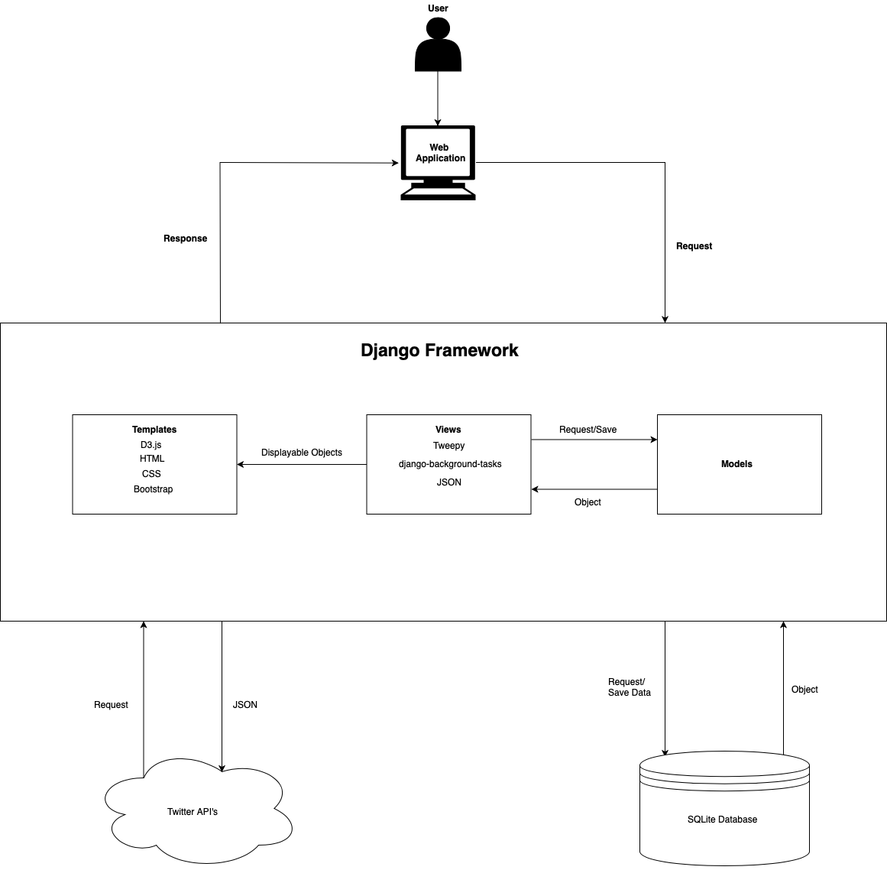
  
&nbsp;
  
#### 2.2 System Architecture Overview

**Web Application** - This represents the front-end interface. The user can interact with the front-end interface.

**Views** - A Django view is short for a view function. It is a Python function which takes a web request and returns a web response. The views also handle redirects and various errors. Within the views, the Twitter APIs are being called using Tweepy. The Twitter APIs are returning the JSON back to the application, where it is being parsed and rendered to the templates to be displayed. The background tasks are also being created and scheduled within the views, and then they are stored in the database. All database operations are also being formed in the views. This includes creating and saving objects or fetching objects from the database. 

**Models** - Django models are a description of the stored data. It contains information about fields and types of data that is being stored. The application has models which store the data about the chosen tweet, the data being collected as the tweet is being monitored. 

**Templates** - A Django template contains the HTML output of a page. It also includes special syntax to display certain contents. The ‘base.html’ templates are the HTML base for each page. Within the other templates, there is Django syntax which allows the called objects to be displayed on the template. The graph rendering is also taking place in the templates. The D3.js visualisations are being created using plot.ly and are being displayed through the template. 

**SQLite Database** - SQLite is a C-language library that implements an SQL database engine. By default, the Django configuration uses SQLite. The data that is being stored in the application database is user authentication data, data associated with the tweets and data collected by monitoring the tweets over time. 

**Twitter APIs** - This returns data from Twitter that has been requested. The data being returned by these APIs is search data associated with tweets and user data associated with certain Twitter handles. These APIs are accessed using Tweepy in the views file.
  
&nbsp;
  
###  3. High-Level Design
  
&nbsp;
  
#### 3.1 Context Diagram

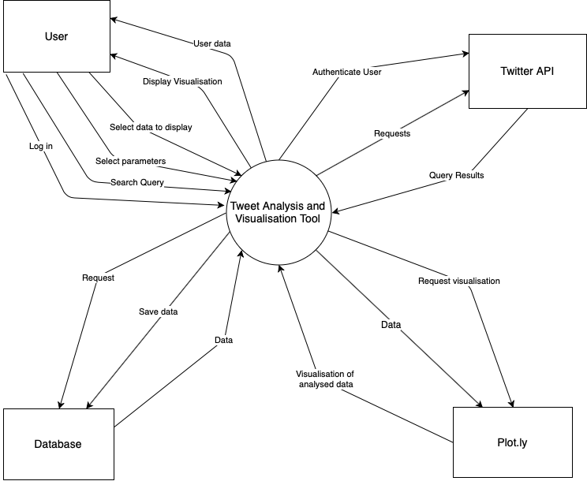
  
&nbsp;
  
#### 3.2 Context Diagram Description
User - The user entity is the person who can interact with the application once they have been authenticated.
Twitter API - The Twitter API entity receives a request for information and delivers it in JSON format. The Twitter APIs used are the search and user APIs.
Database - This is where all of the data of the application is stored. It stores the user’s login information and all the data surrounding saving and monitoring a tweet.
Plot.ly - This is the charting library which creates the D3.js visualisations. It receives the data in JSON format and forms the graph. It then returns it to the views where it is rendered by the application.
  
&nbsp;
  
#### 3.3 Data Flow Diagram

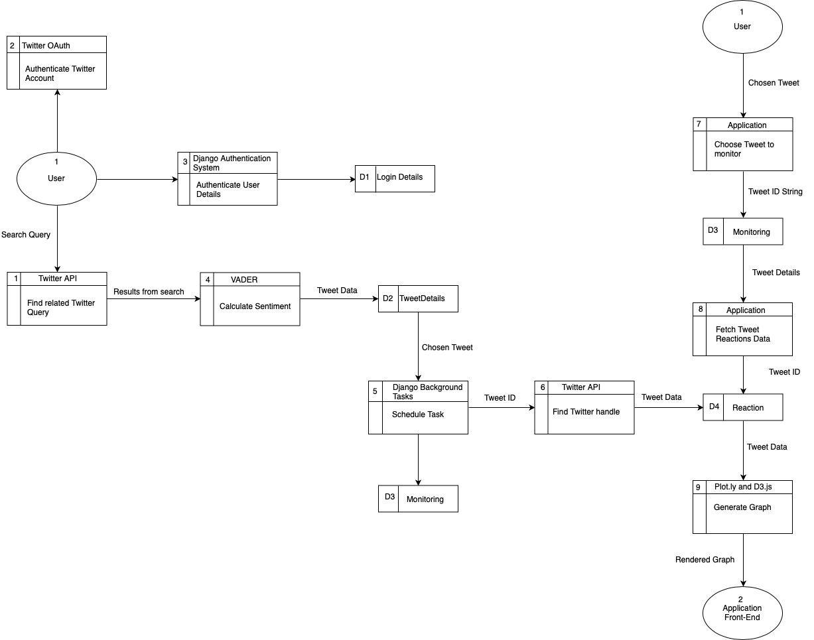
  
&nbsp;
  
###  4. Problems and Resolution
  
&nbsp;
  
#### 4.1 Rate Limits
Twitter APIs have standard rate limiting. This means that there is a limit on the requests that can be made to an API within a certain time limit. With the Search API and User API, the limits are 15 requests per 15 minutes. If there were too many requests in that 15 minute period, an error would be returned. To counteract this, we have set up our background tasks to run the monitoring every 15 minutes. This will ensure that the rate limits won’t be hit, and also allows enough remaining requests for the user to make through searches on the application. We have also thoroughly error-handled every call to the API to ensure that, if the rate-limits were hit, the user would not see the Django error message but would instead be asked to try again in 15 minutes. For testing purposes, we also have two sets of Twitter API keys so that our testing would never be delayed if we hit rate limits.
  
&nbsp;
  
#### 4.2 Introducing parameters to the monitoring. 
One of the focal points of the monitoring on the application is being able to parameterise the monitoring. This means that the user can choose a date for the application to stop monitoring a tweet, or they can choose a number of likes and/or retweets goal for the tweet to reach before the application stops monitoring it. The introduction of parameters had to work with the Django Background Tasks library as this is what would be making the background calls to the API. It also had to be able to pass parameters into the correct view to start the monitoring. It proved challenging to do so at first. It was extremely important that the date field could be distinguished from the likes and retweets field. The solution was to design an overall view which would check the parameters selected by the user, and four other views which would handle when to end the monitoring.
  
&nbsp;
  
#### 4.3 Speed of loading the graphs
As increasing data was being gathered, the graphs began to load more slowly, due to the higher amount of calls to the APIs. This dramatically affected the load time of the graphs. In order to combat this, the tweet data was stored in the database each time it was called. This means that only new tweets and information are called and updated. The information is stored in the database with the primary key being the individual tweet id number. The graphs then call the database information in order to render the information.
  
&nbsp;
  
#### 4.4 Real-time updating of the graphs
It was originally planned to display the graph updating in real time. However, due to the fact that the tweet data information is being monitored over a period of days/weeks, this was unnecessary. The tweet activity does not change meaningfully enough over a second-by-second timeframe. As the free version of the Twitter developer API is being used, calls are limited to 15 calls every 15 minutes, and so this also affected the possibility of the real-time display. Each time the graph is called, the updated version is displayed with the most recent information.
  
&nbsp;
  
#### 4.5 Jupyter Notebook
It was planned to use the Jupyter Notebook to display the graphs. However, linking this to the individual Django user’s profile page proved difficult. In researching the gathering of sentiment analysis and transferring this to the user page, it was deemed that the use of Jupyter Notebook was not required and instead created our graphs within the Django application HTML using Plotly and D3.js. This ensured that the searches and monitors of each user were stored to their individual profile.
  
&nbsp;
  

### 5. Testing
#### 5.1 Unit Testing
The Django Framework allows a file to be created within the application called tests.py which, by running the command “python3 manage.py test” runs the unit tests that have been created. These unit tests allow the developers to track and find anomaly paths and code errors within the application. See below the terminal window with some of the completed tests.  
  
&nbsp;
  
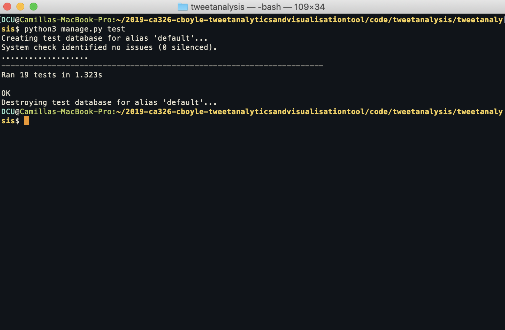  

**Figure 1: Unit tests completed**
  
&nbsp;
  
#### 5.2 Browser Testing
In order to ensure that the web application was visible and displayed effectively in all browsers, the application was run in Google Chrome, Firefox and Safari. The following images show the application home page being displayed in these three browsers. Compatibility for these browsers is important to ensure that the vast majority of users can access the application.  
  
&nbsp;
  
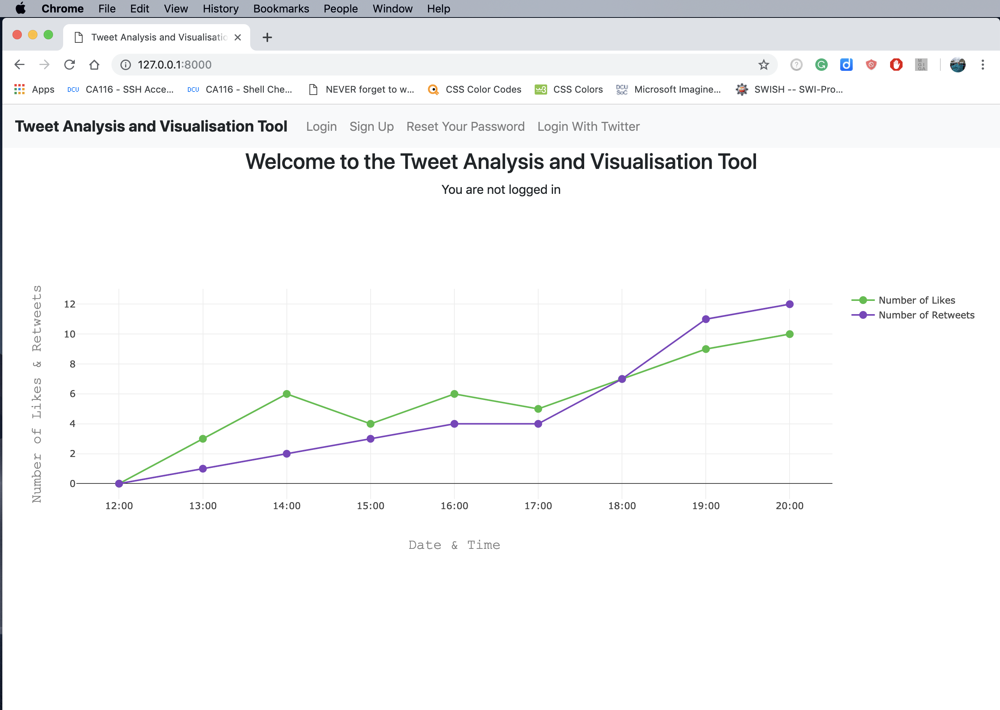  

**Figure 2: Homepage on Google Chrome**
  
&nbsp;
  
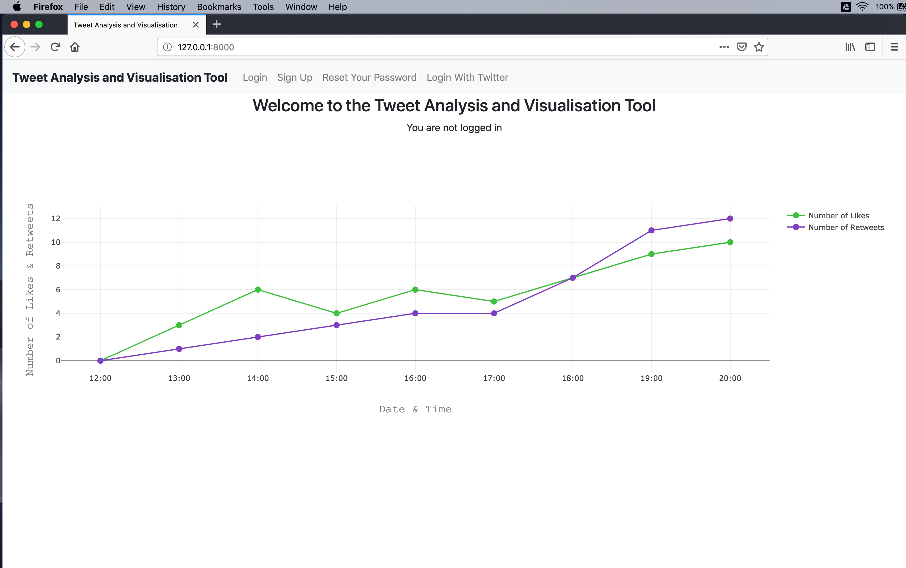  

**Figure 3: Homepage on Firefox**  
  
&nbsp;
  
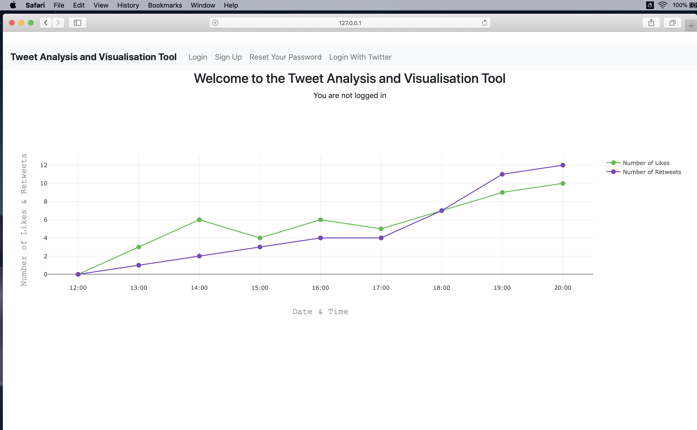  

**Figure 4: Homepage on Safari**  
  
&nbsp;
  

#### 5.3 Comparison Testing
To verify that the data gathered reflects accurate information, the official Twitter website was accessed. The tweet being monitored was then compared on this website with the information gathered by the Tweet Analysis and Visualisation Tool application. These results are displayed below.  
  
&nbsp;
  
  

**Figure 5: Screengrab of the tweet from Twitter**  
  
&nbsp;
  
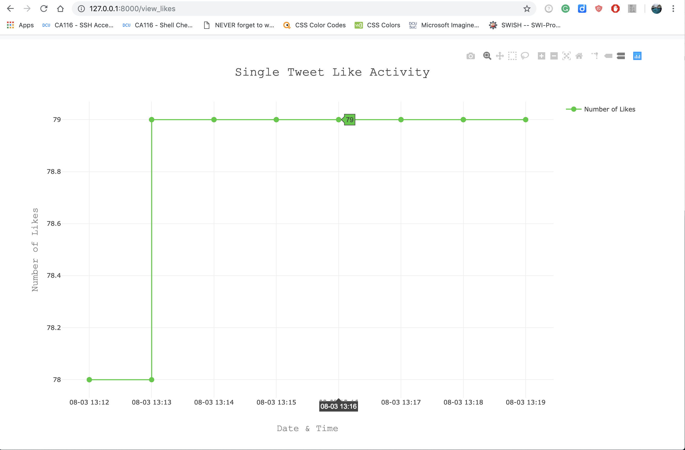  

**Figure 6: Screengrab of the tweet monitoring number of likes**  
  
&nbsp;
  
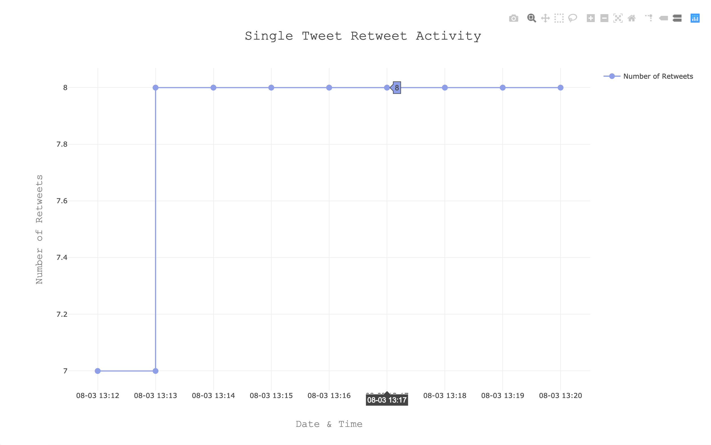  

**Figure 7: Screengrab of the tweet monitoring number of retweets**  
  
&nbsp;
  
  

**Figure 8: Screengrab of the tweet from Twitter after monitoring**  
  
&nbsp;
  
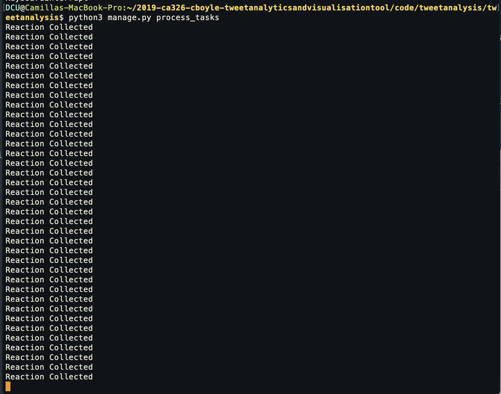  

**Figure 9: Screengrab of the background tasks running for monitoring data**  
  
&nbsp;
  

#### 5.4 Tweepy Testing
Tweepy is the tool being used to access Twitter information and tweets. A comprehensive stress test was completed to verify rate limit error handling and find other errors that may occur. In order to stress test this, several large Twitter accounts were followed and tweets were selected that had high levels of interaction. This ensures that when rate limits were reached, the application slept until the rate limits were removed in order to continue collecting data, rather than simply exiting.
  
&nbsp;
  
#### 5.5 Accessibility Testing
It is important that the application is accessible to a large audience base. In the creation of this tool, a large consideration was the colours used and the overall format of the application. In choosing the colours for the graph, we ensured that they were striking enough to be verifiably different and visible to those with poor vision or those that have difficulty distinguishing colours. Through the use of Bootstrap, front-end components should be understandable and operable using technologies such as screen readers. This is because Bootstrap uses WAI-ARIA attributes in its components.
  
&nbsp;
  
#### 5.6 Installation Testing
To ensure that installation would be smooth, an installation test was required. This involved setting up a Ubuntu Virtual Machine. This is a different operating system to what the development was done on, which was macOS. The purpose of this was to ensure that the application could be set up and run in multiple environments. The installation test was a success, and by running pip3 install -r requirements.txt, all necessary packages were installed. Finally, the application could be viewed at <http://127.0.0.1:8000>.
  
&nbsp;
  

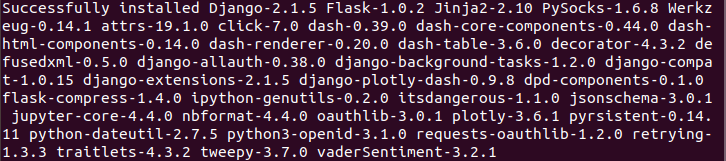   

**Figure 10: Installation Successful Message**
  
&nbsp;
  

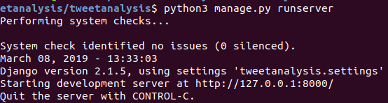  

**Figure 11: Server running on Ubuntu**
  
&nbsp;
  
### 6. Installation Guide
#### 6.1 Install locally

To run Tweet Analysis and Visualisation Tool, there are a number of steps to be followed. 

First, clone the gitlab repository, located at:

*https://gitlab.computing.dcu.ie/boylec36/2019-ca326-cboyle-tweetanalyticsandvisualisationtool.git*

Save the repository locally. Next, navigate to the directory : 

*2019-ca326-cboyle-tweetanalyticsandvisualisationtool/tweetanalysis/tweetanalysis*

Run the following command:

*$ pip3 install -r requirements.txt*

This command will install all necessary packages and libraries to run the application. It will install the following packages:

Django==2.1.5  
django-allauth==0.38.0  
django-extensions==2.1.5  
django-plotly-dash==0.9.8  
django-background-tasks==1.2.0  
tweepy==3.7.0  
vaderSentiment==3.2.1  
python-dateutil==2.7.5  

Next, run the command: 

*$ python3 manage.py runserver*

Open a second terminal window and navigate to : 

*2019-ca326-cboyle-tweetanalyticsandvisualisationtool/tweetanalysis/tweetanalysis*

Run the command:

*$ python3 manage.py process_tasks*

Navigate to <http://127.0.0.1:8000> to use the application.
  
&nbsp;
  
###  7. References

<https://plot.ly>  
<https://docs.djangoproject.com/en/2.1/>  
<https://www.sqlite.org/index.html>  
<https://getbootstrap.com>
