# Tweet Analysis and Visualisation Tool
## User Guide

**
 Camilla Boyle & Emily McGivern 
**

### Table of Contents
* [**1. What is Tweet Analysis and Visualisation Tool?**](#what-is)
* [**2. Starting the application**](#starting)
* [**3. Login**](#login)  
  * [**3.1. Register New User**](#register-new)
  * [**3.2. Login with existing details**](#login-existing)
  * [**3.3. Login with a Twitter Account**](#login-twitter)
  * [**3.4. Forgot your password**](#forgot-password)
* [**4. Search for a tweet to monitor**](#search-monitor)
* [**5. View Your Profile**](#view-profile)
* [**6. Start Monitoring**](#start-monitoring)
* [**6. View your graphs**](#view-graphs)
* [**7. View monitoring results**](#view-results)
* [**8. Logout**](#logout)

&nbsp;  
  

&nbsp;  

  

&nbsp;  

***  
  

&nbsp;  

  
&nbsp;  

  
&nbsp;

### 1. What is Tweet Analysis and Visualisation Tool?
Tweet Analysis and Visualisation Tool is a web application that allows a user to get meaningful insights into tweets of their choice. This is done by tracking the sentiment of the tweet and responses to a tweet over time. The user can track their own tweets or can track those of other users. The application is extremely flexible and very intuitive. There is very little prior knowledge needed to use the application.
  
&nbsp;
  
### 2. Starting the application
To start the application, please visit http://127.0.0.1:8000. Here, you will be met with the home page. This is where you can login or sign up to use the application (see image 1). 
  
&nbsp;
  
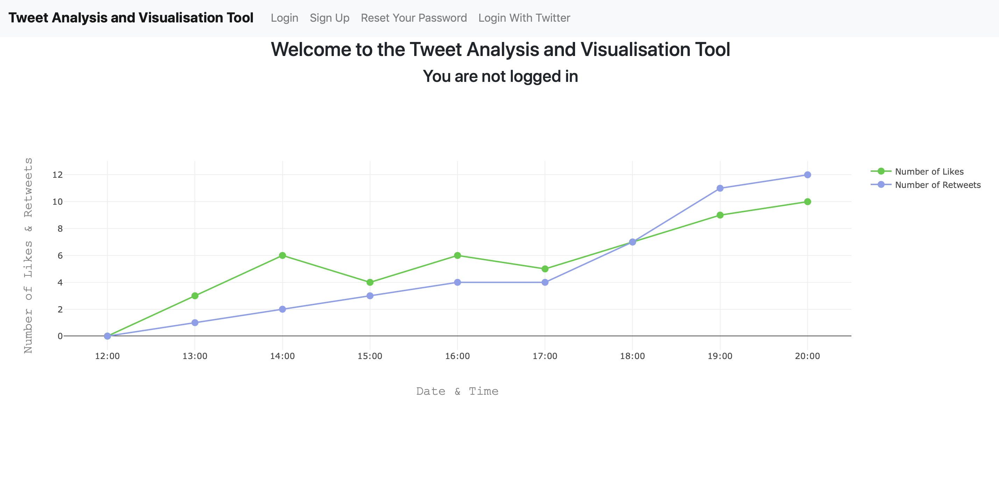  
**image 1: Home**  
  
&nbsp;
  
  
### 3. Login
There are two ways to log in to the application. A user must have previously registered to be able to use the application or must have a valid Twitter login.

#### 3.1 Register a new user
To register a new user, please click the Sign-Up button, located in the top bar of the home page. This will bring you to the sign-up page, where you can create an account (see image 2). To create an account, please follow the instructions provided on the form. A valid username and password are required. You should enter your chosen username along with a password. Your password must be at least 8 characters in length. It also may not be commonly used and cannot be entirely numeric. It should not be similar to other user information.
  
&nbsp;
  
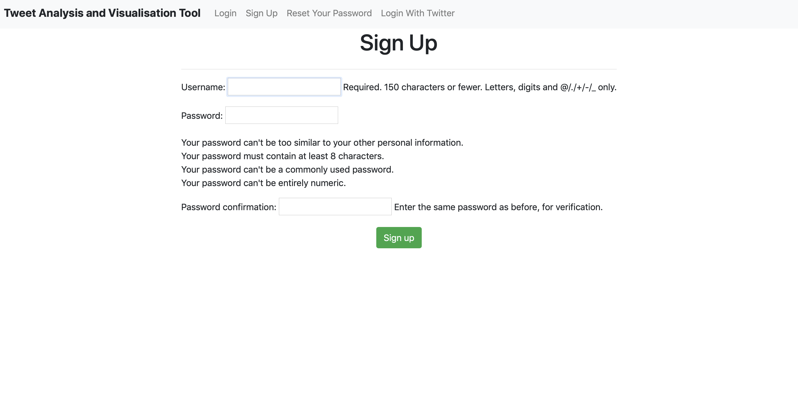  
**image 2: Sign Up**  
  
&nbsp;
  

#### 3.2 Login with existing details
If you are a user who has previously registered an account on the application, you can log in using your details by clicking on the Login button in the top bar. This will bring you to the login page (see image 3). You then enter your username and password. Once you click the button you will be signed in. 
  
&nbsp;
  
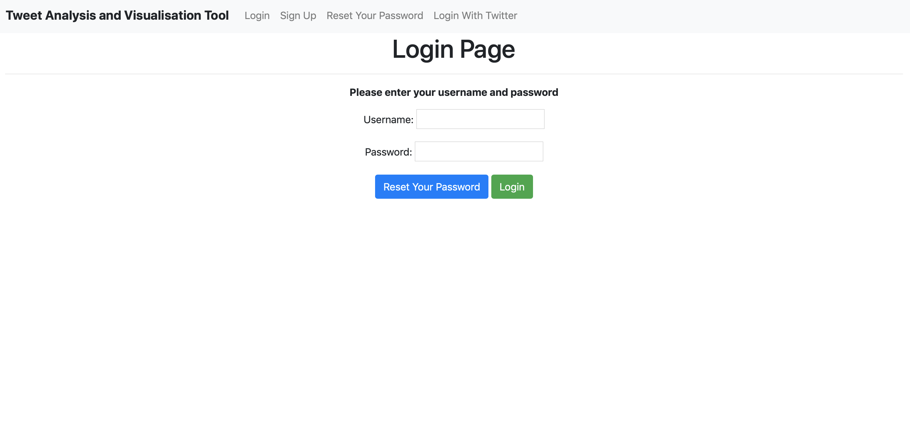  
**image 3: Login**  
  
&nbsp;
  

#### 3.3 Login with a Twitter Account
If you have a Twitter account, you can log in with this. To do so, click the Login with 
Twitter button located in the top bar. This will redirect you to an external page where Twitter can authenticate you as a user (see image 4). Once you have been authenticated, you will be redirected back to the application.
  
&nbsp;
  
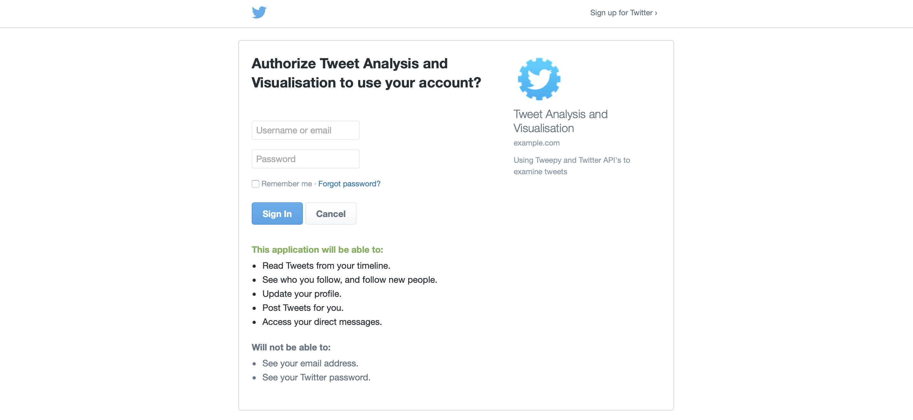  
**image 4: Login with Twitter**
  
&nbsp;
  
	
#### 3.4 Forgot your password
Should you forget your password, click on “Reset Your Password”, enter your email address and we’ll send you a link with instructions on how to reset your password (see image 5). After clicking submit, you will be shown the email sent page (see image 6).
  
&nbsp;
  
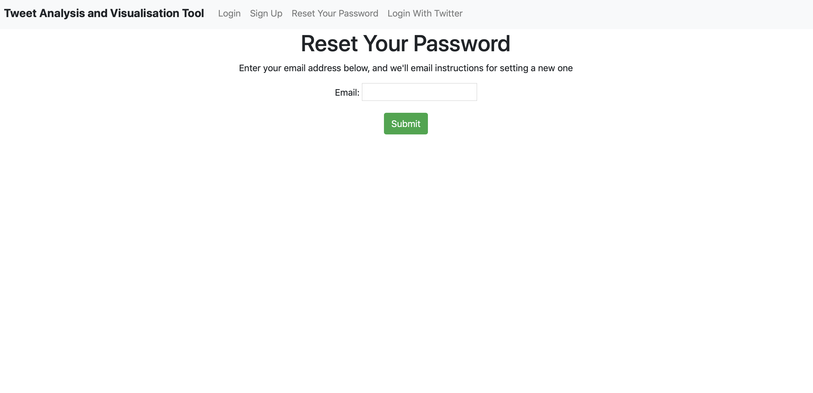  
**image 5: Reset Your Password**
  
&nbsp;
  
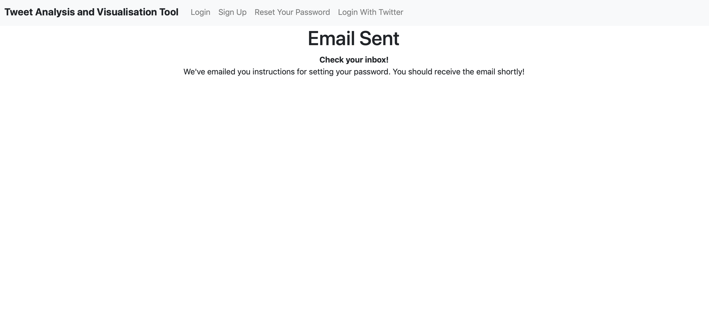  
**image 6: Email Sent**
  
&nbsp;
  
#### 4. Search for a tweet to monitor
From the index page, you can begin searching for tweets to monitor (see image 7). By clicking on each tab, you are given different search bars to be able to search for different things. The options are to search by a user, search by hashtag, or search by term. Select the appropriate tab. Once you have entered your desired search term, click on the search button. This will allow you to choose the tweet you want to monitor. If you are searching by user, you can choose the user on the following page, and will then be shown their tweets. From here, you will select the user/tweet and click confirm. If you change your mind, click “Start Again” and you’ll be redirected to your home page. Once you have chosen a tweet, you will have the option to run analysis or start another search. 
  
&nbsp;
  
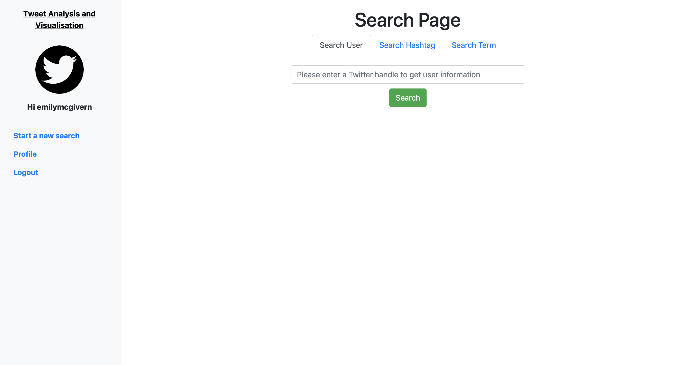  
**image 7: Search Page**  
  
&nbsp;
  
#### 5. View your profile
When you click on the “Run Analysis” button, you will be sent to your profile page. Here, there are three tabs. One tab contains the tweets you are currently monitoring. The centre tab contains the tweets you have saved but are not monitoring. The right tab contains links to the “View Followers vs Sentiment” graph and the other related graphs which a user can view (see image 8). From the index page, you can begin searching for tweets to monitor. By clicking on each tab, you are given different search bars to be able to search for different things. The options are to search by user, search by hashtag or search by term. Select the appropriate tab. Once you have entered your desired search term, click on the search button. This will allow you to choose the tweet you want to monitor. If you are searching by a user, you can choose the user on the following page, and will then be shown their tweets. From here, you will select the user/tweet and click confirm. If you change your mind, click “Start Again” and you’ll be redirected to your home page.
  
&nbsp;
  
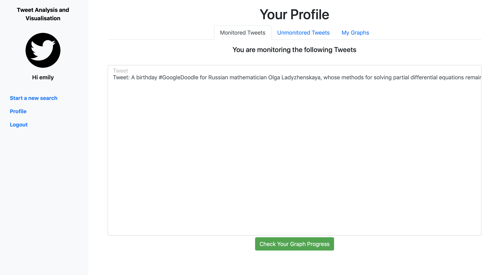   
**image 8: Profile**
  
&nbsp;
  
#### 6. Start monitoring
On your profile page, navigate to the “Unmonitored Tweets” tab (see image 9). Click on the tweet you would like to start monitoring and hit “Monitor”. You also have an option to delete tweets you no longer want to save on this page using the “Delete” button. Once you have hit monitor, you will be brought to the next page when you can customise your monitoring (see image 10). You can enter a date which you would like your tweet to be tracked until, or you can enter the number of likes and/or retweets to tweet has to reach before the application stops tracking it. Once you have entered your parameters, hit “Start Monitoring” on the chosen field. Your tweet will now be monitored until it reaches its specified goal. You will be returned to your profile.
  
&nbsp;
  
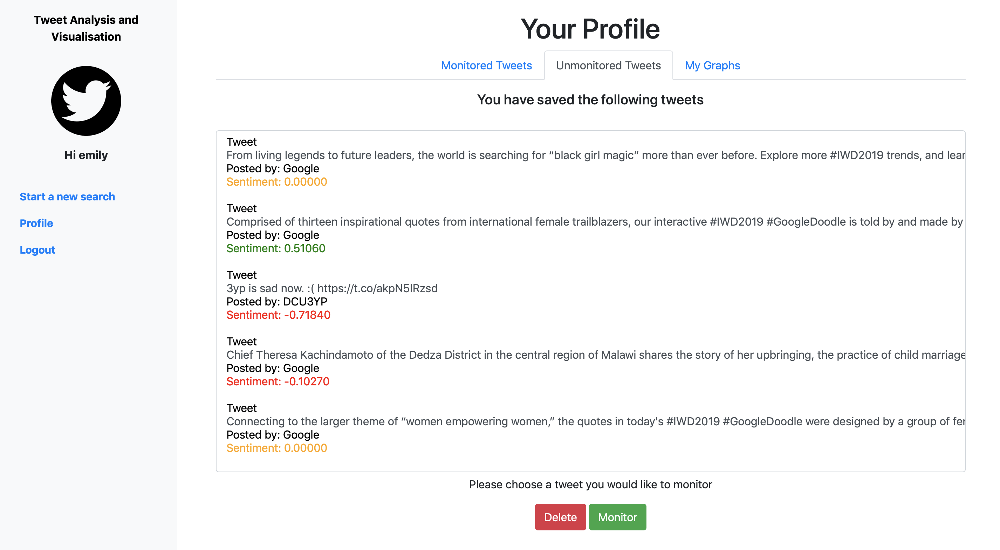   
**image 9: “Unmonitored Tweets” tab**
  
&nbsp;
  
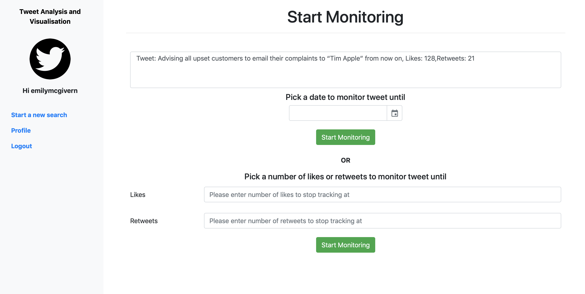 
**image 10: Start Monitoring Page**
  
&nbsp;
  
#### 7. View your graphs
On your profile page, navigate to the “My Graphs” tab (see image 11). Click on the graph you would like to view. You will be taken to the graph page (see image 12). Along the top, you can navigate between all the related graphs. There are three graphs available: the number of likes, retweets and followers your tweet has, along with their sentiment. In these graphs, the tweets are colour-coded according to sentiment: green for positive, orange for neutral and red for negative. 
  
&nbsp;
  
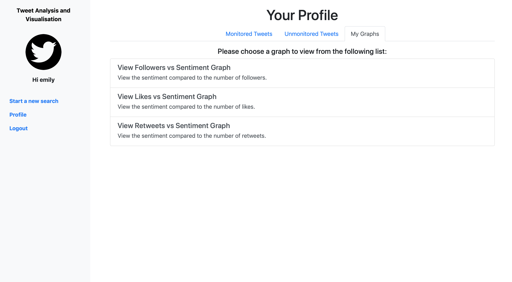  
**image 11: Choose Graph to View** 
  
&nbsp;
  
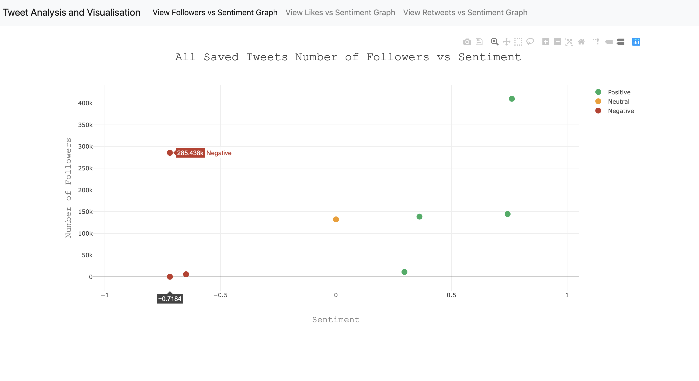  
**image 12: View graph page**
  
&nbsp;
  
#### 8. View monitoring results
On your profile page, navigate to the “Monitored Tweets” tab. Select the tweet you would like to view and click on “Check Your Graph Progress”. You will be taken to a page where you can choose which graph you would like to view first. Once you choose a graph, you are taken to the graph page (see image 13).  Along the top, you can navigate between all the related graphs. There are five graphs available displaying different data. 
  
&nbsp;
  
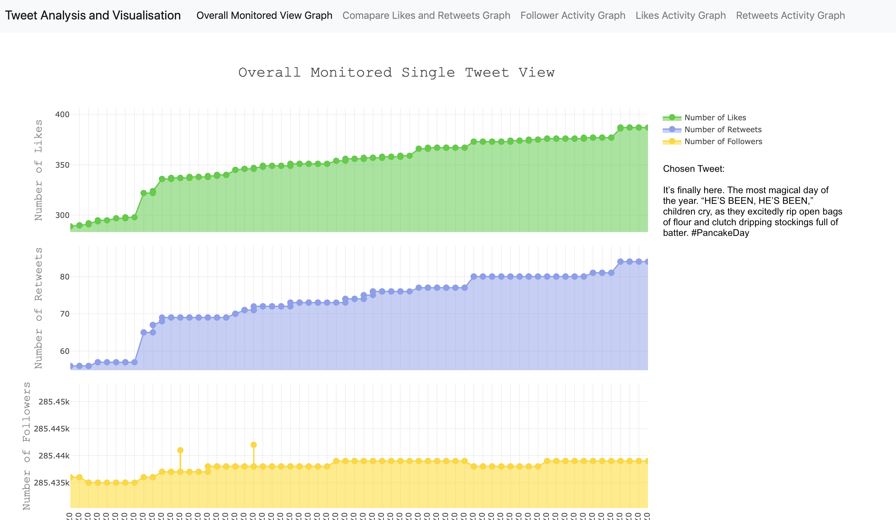  
**image 13: View monitoring graph page**
  
&nbsp;
  
#### 9. Logout
Click the logout button on the sidebar to log out of the application (see image 14). When you log out you will return to the original page (see image 15).
  
&nbsp;
  
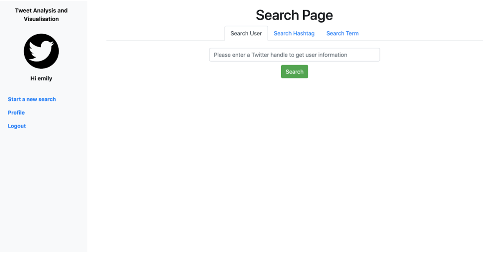  
**image 14: Logout**
  
&nbsp;
  
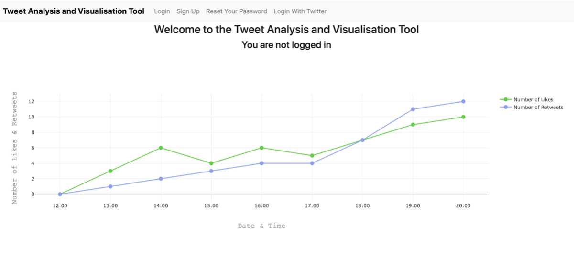  
**image 15: Screen after logging out**